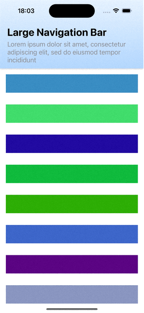

# Adaptive Navigation Bar

An example of a SwiftUI navigation bar that transitions from a large to small state based on scroll offset (in Y).

## Questions

* `StickyTop` uses a `VStack` for the navigation bar layout since `safeAreaInset(edge: .top)` causes scroll glitches
* `OffsetScrollView` adds a `GeometryReader` to the background of its content to measure scroll offset. Is this performant?

## References

* [Observing scroll offset in SwiftUI](https://www.swiftbysundell.com/articles/observing-swiftui-scrollview-content-offset)
