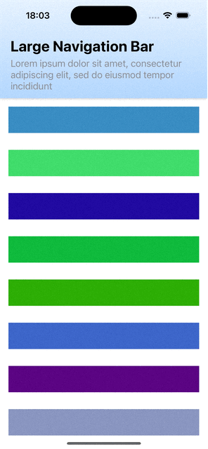

# Adaptive Navigation Bar

An example of a SwiftUI navigation bar that transitions from a large to a small state based on the scroll offset.
The implementation allows for any custom `SmallNavigationBar` and `LargeNavigationBar` SwiftUI views to be used for the two states.

## Questions

* `StickyTop` uses a `VStack` for the navigation bar layout since `safeAreaInset(edge: .top)` causes unexpected scroll glitches?
* `OffsetScrollView` adds a `GeometryReader` to the background of its content to measure scroll offset. Is this performant?

## References

* [Observing scroll offset in SwiftUI](https://www.swiftbysundell.com/articles/observing-swiftui-scrollview-content-offset)
* [Get SwiftUI view size](https://www.fivestars.blog/articles/swiftui-share-layout-information)
